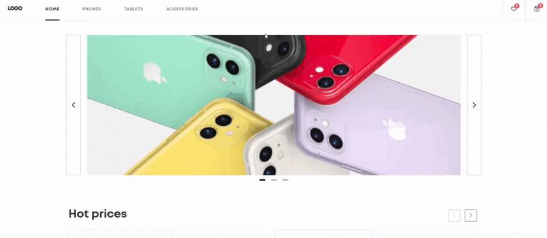
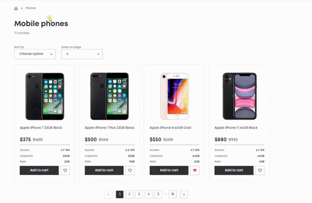
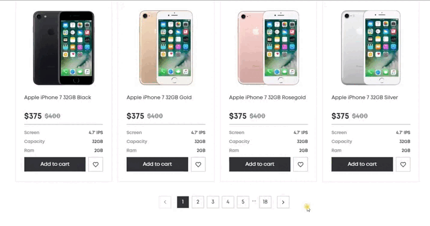

# Phone Catalog

- [DEMO LINK](https://valeraviachalo.github.io/phone_catalog/)

## Technologies
- HTML
- Sass (SCSS)
- Typescript
- BEM
- React
- React Router
- localStorage
- Classnames
- Swiper.js
- UIBall
- Framer motion
- React responsive carousel
- React awesome reveal

### Adaptive
- Desktop: 1280px
- Tablet: 768px
- Mobile: > 320px

 

## Features

### Pages Fade Transition

### Home Page
- Main banner created with `React responsive carousel`
- 
  

- Categories with counters
- 
  

- 2 product swipers
  
  - `Hot Prices` swiper

    

  - `Brand new models` swiper

    

- Home page response

  

 

### Product Page
- **Product filter**
  - where users can choose how many items on one page and sort by: newest, alphabetically, cheapest 

  

- **Search**
  - When users search through the shop and then try to find the current phone using the search bar, they are directed to the first page. Also, clearing the query takes them back to the first page.

  

- **Pagination**
  - When a page has 16 or more items and users try to navigate to another page, they are positioned at the top of the new page for a smoother experience.

  

  - Responsive design for comfortable browsing on all devices

  

 

### Product Details Page
  - When a user finds something interesting, they can go to find details
  
  

  - **Gallery**
    - The gallery has a main photo which changes by the user's click

      

  - **Choose Container**
    
    In that block, the user can choose available colors

    

    And capacities
    
    

    - and also add to the cart or favorites

    

  - **Details and Swiper**
    - At the bottom, the user can discover more about the phone and also watch other variables

    

 

### Favorites
  - There is a list of products the user likes, they can add to the cart or remove from the favorite list

  

### Cart 
  - **Cart product cards**
    
    - There, the user can see the price of the current product or choose the quantity or remove it

      

  - **Total price and checkout**

    - It's a card where the user sees the final price and can order the product (but unfortunately that feature is not implemented)

    

## How to Run
1. Install Node.js version 14.18.0.
2. Open the project and run `npm install`.
3. Run `npm start`.
4. Done.
